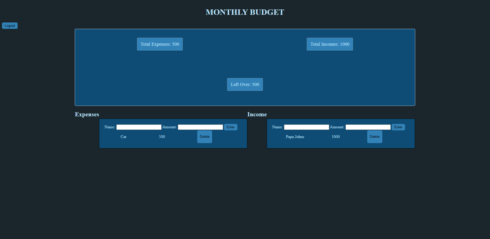

# Budget App

## Table of Contents:

- [Purpose](#purpose)
- [Technologies](Technologies)
- [Features](#features)
- [Website](#website)

## Purpose

- A simple budget app where you can add expenses and income. Just create an account and add your bills!

## Technologies

- CSS
- Node.js
- Express.js
- Express-Session
- MySQL
- Sequelize
- JawsDB
- dotenv
- bcrypt

## Features

- Clean user interface
- Easy to use website
- Password encryption
- Add and delete bills and income

## Website

[Deployed Dev Connect](https://budget-application-1999.herokuapp.com/)

