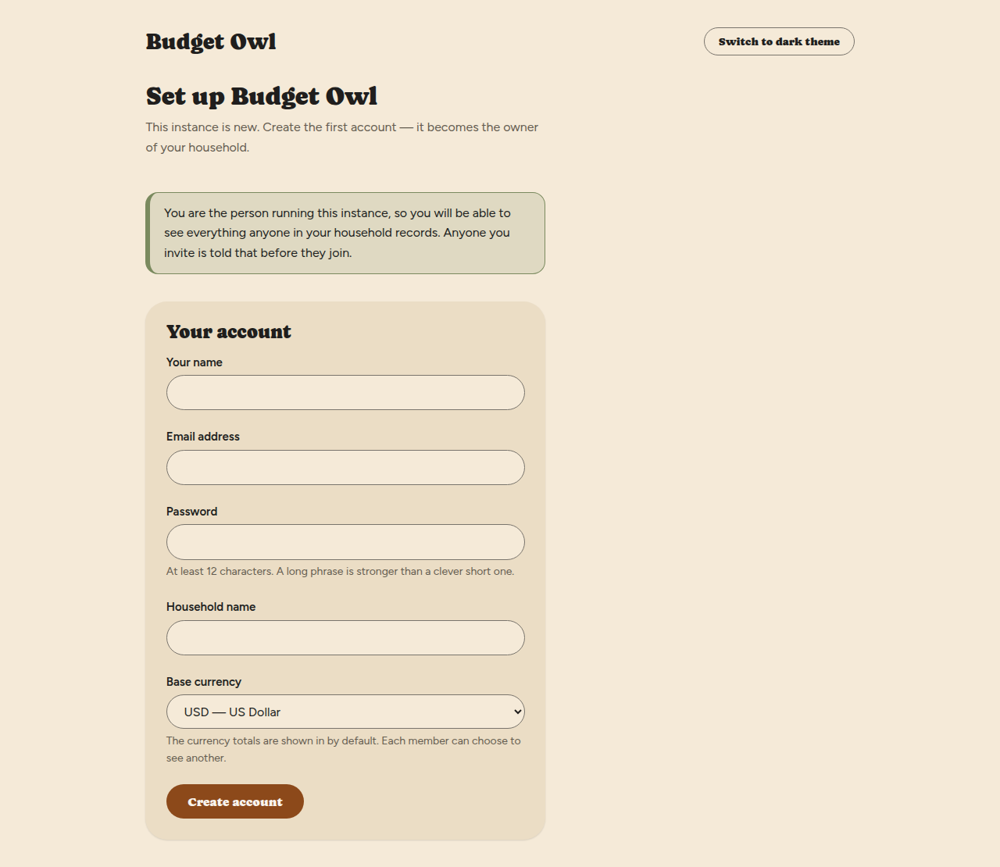
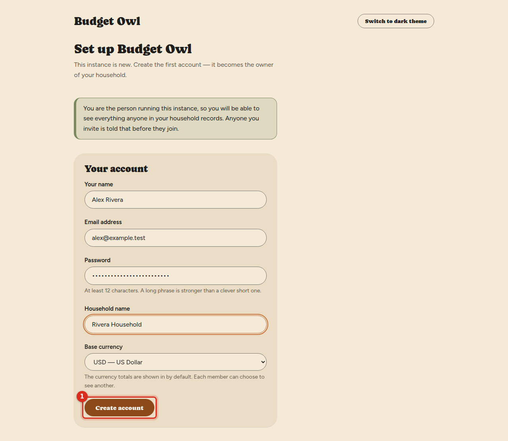
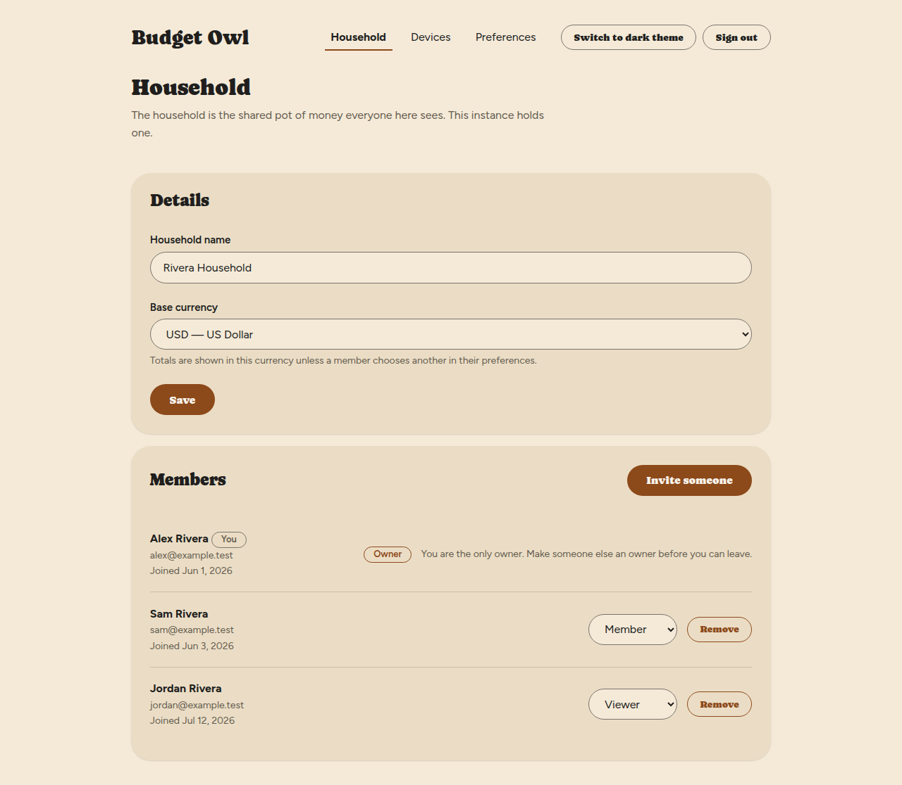

# Create your account and household

The first time Budget Owl starts, it asks you to create one account. That account becomes the
**owner** of a new household — the shared space where your accounts, transactions and budgets
live. Everyone you invite later joins this household.

## Before you start

- Budget Owl needs to be running on your server. If it is not, see
  [Installing Budget Owl](../installing.md).
- This is for the person who set Budget Owl up. If someone has already invited you to a
  household, you want [Join a household](join-a-household.md) instead.

**Read this first: you will be able to see everything anyone in your household records.**
You are the person running this instance. Whatever you and your household record in it — every
transaction, every balance, every note — can be seen by whoever runs the server, and that is you.
Budget Owl does not hide it. Anyone you invite is told this before they join, so it is worth
having that conversation with them yourself too.

## Steps

1. Open Budget Owl in your web browser, at the address of your server.

   You'll see a screen called **Set up Budget Owl**. It tells you that this instance is new and
   that the first account becomes the owner of your household.

   

2. Enter your name in **Your name**.

   This is the name shown for you in the **Members** list.

3. Enter your email address in **Email address**.

   This is what you sign in with.

4. Enter a password in **Password**.

   It needs at least 12 characters. A long phrase is stronger than a clever short password. If
   it is too short, you'll see **Use at least 12 characters.** under the field when you try to
   continue.

   

5. Enter a name for your household in **Household name**.

   Something like "Rivera Household". You can change it later on the **Household** screen.

6. Check **Base currency**.

   It starts as **USD — US Dollar**. This is the currency totals are shown in by default. Each
   person in the household can choose to see a different one, so this is not a decision that
   locks anyone in.

7. Select **Create account**.

   

## What you'll see

Your account is created and you are signed in straight away. You land on the **Household**
screen, with your household's name in the **Household name** box and yourself at the top of the
**Members** list, marked **You** and **Owner**.

The next thing to do is usually [invite the rest of your household](invite-someone.md).

## Things that can go wrong

**You see a sign-in screen instead of "Set up Budget Owl".**
Someone has already created the first account on this instance. Sign in with that account, or ask
whoever set it up to invite you. See [Sign in](sign-in.md).

**You see a red or orange message under a box when you select Create account.**
Read the message under the box — it names the problem, such as a password under 12 characters or
a box left empty. Nothing is saved until every box is filled in correctly.

## Related

- [Sign in](sign-in.md)
- [Invite someone to your household](invite-someone.md)
- [What the roles mean, and managing members](manage-members.md)
