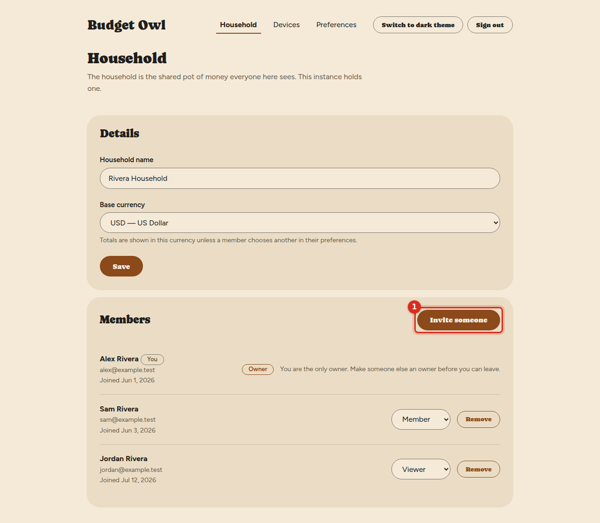
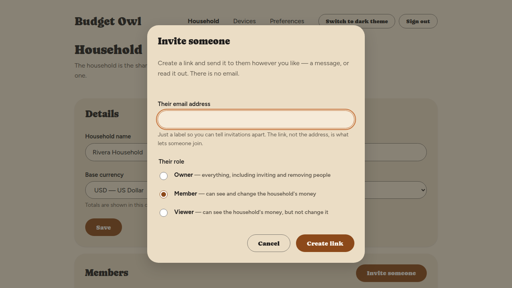
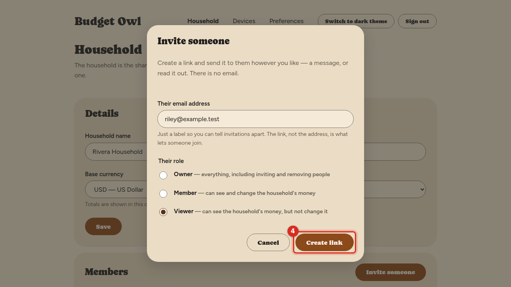
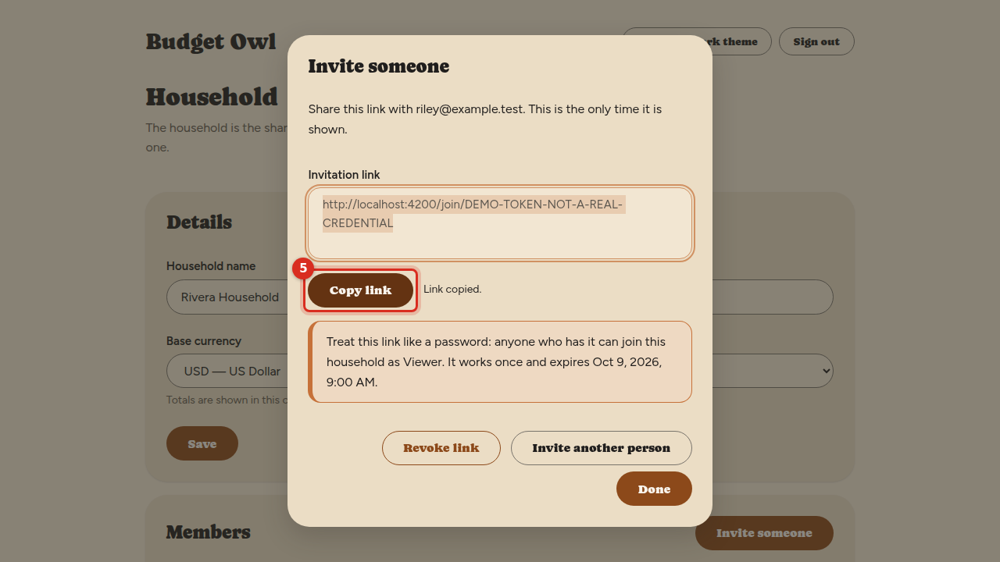
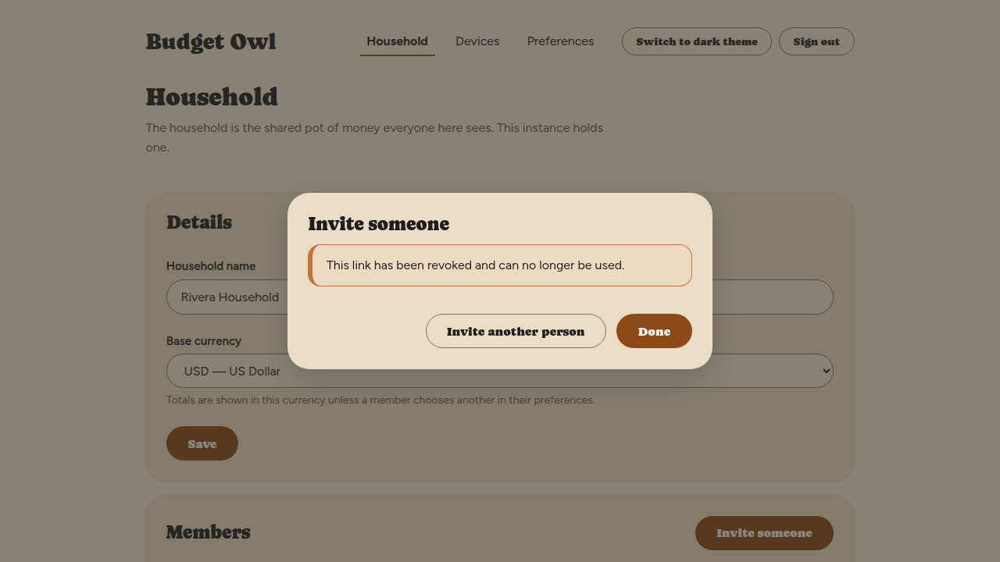

# Invite someone to your household

Add a partner, a family member or anyone else you share money with. You create an invitation
link and send it to them yourself — in a message, or by reading it out. Budget Owl does not send
any email.

## Before you start

- You need to be an **owner** of the household. If you do not see an **Invite someone** button on
  the **Household** screen, you are not an owner — see [What the roles mean](manage-members.md#what-the-three-roles-mean).
- Decide what role they should have. **Owner**, **Member** or **Viewer** are explained in step 3.

**Two things to understand before you send anything.**

**The invitation link is like a password.** Anyone who has the link can join your household —
whoever it was meant for, and anyone it is forwarded or shown to. Send it only to the person you
mean, by a channel you trust, and do not post it anywhere other people can read. If you think it
has reached the wrong person, revoke it (see below) and make a new one.

**Whoever runs the server can see everything your household records.** Every transaction, every
balance, every note is visible to the person who runs this instance. Budget Owl does not hide
your data from them — and neither does it hide it from anyone else in the household. The person you
invite is told this on the invitation screen, before they join. It is fair to tell them yourself
as well, especially if you are not the person who runs the server.

## Steps

1. Go to **Household** and select **Invite someone**.

   A window called **Invite someone** opens.

   

   

2. Enter their email address in **Their email address**.

   Enter the address they will sign in with. The screen calls this address a label — it is not
   what lets them in; the link does that. But if they do not already have an account on your
   server, their new account is created with this address, so type it carefully. If they already
   have an account, use the address of that account.

3. Choose their role under **Their role**.

   - **Owner** — everything, including inviting and removing people.
   - **Member** — can see and change the household's money.
   - **Viewer** — can see the household's money, but not change it.

   **Member** is chosen to begin with. You can change someone's role later from the **Household**
   screen.

4. Select **Create link**.

   

   The window changes to show the link in a box labelled **Invitation link**, with a warning
   underneath it.

   

5. Select **Copy link**.

   **Link copied.** appears beside the button, and the link is ready to paste into a message.
   **This is the only time Budget Owl shows it.** If you close the window without copying it, you
   will need to make a new one.

   

6. Send the link to them.

7. Select **Done**.

   The window closes.

## What you'll see

Under the link, Budget Owl repeats the warning: **Treat this link like a password: anyone who has
it can join this household as** the role you chose. **It works once and expires** on the date it
shows. After one person has used it, or after that date, it stops working.

Once they accept, they appear in the **Members** list on the **Household** screen with the role
you chose. See [Join a household](join-a-household.md) for what they will go through.

## Cancel a link you have already made

If you have not closed the window yet, select **Revoke link**. You'll see **This link has been
revoked and can no longer be used.** Anyone who tries it from then on is told it cannot be used.

To make another one, select **Invite another person**.

## Things that can go wrong

**Something went wrong on our side, with a reference code.**
The link was not created. Try again. If it keeps happening, give the reference code to the
person who runs your server.

**They say the link does not work.**
It has probably expired, been used already, or been cancelled. Budget Owl shows the same message
for all three, on purpose. Make them a new one.

**I closed the window before copying the link.**
There is no way to see it again, and no list of links you have made. Make a new one. The old link
cannot be used by anyone who does not have it, and it stops working on the date that was shown
under it.

## Related

- [Join a household](join-a-household.md) — what the person you invite sees
- [What the roles mean, and managing members](manage-members.md)
