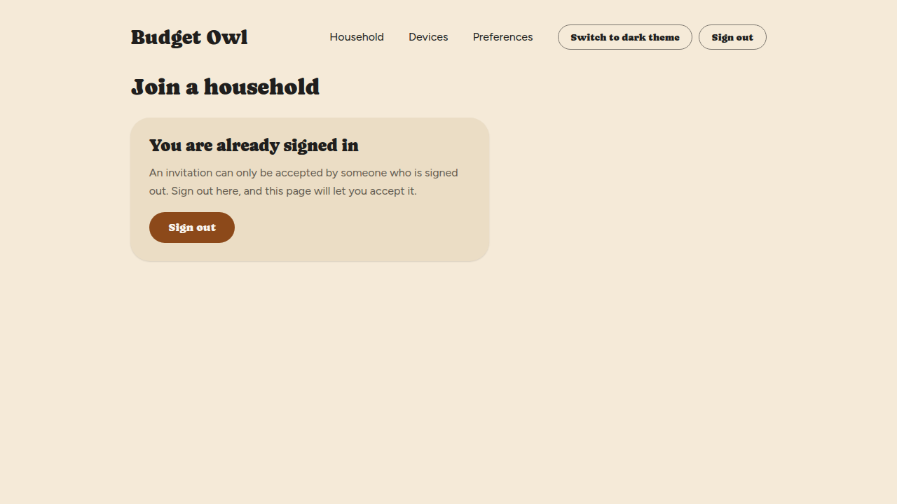
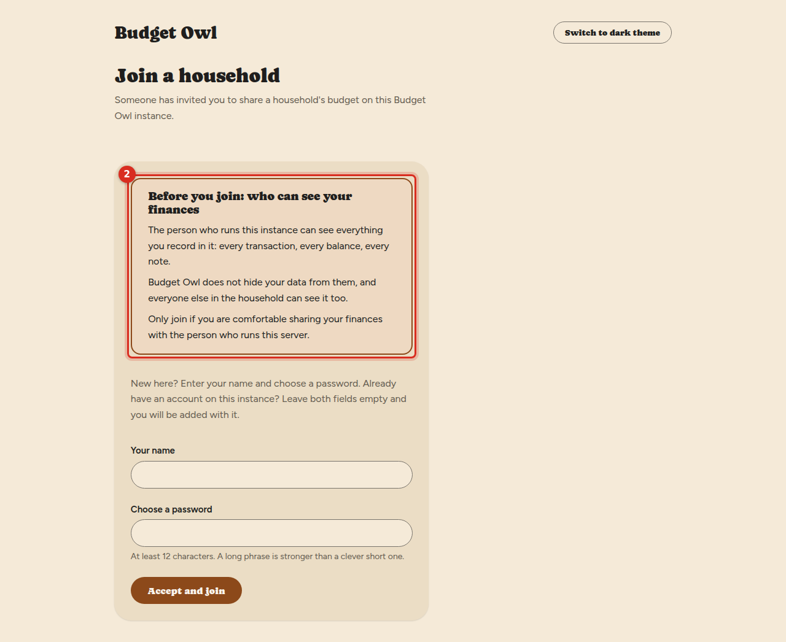
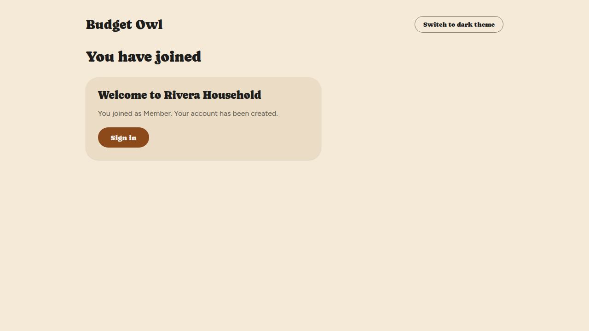
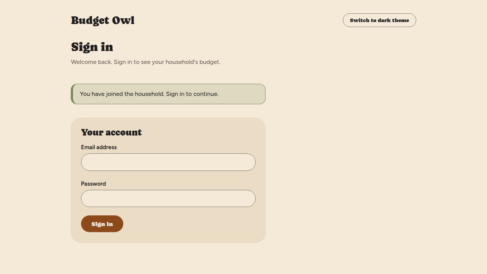
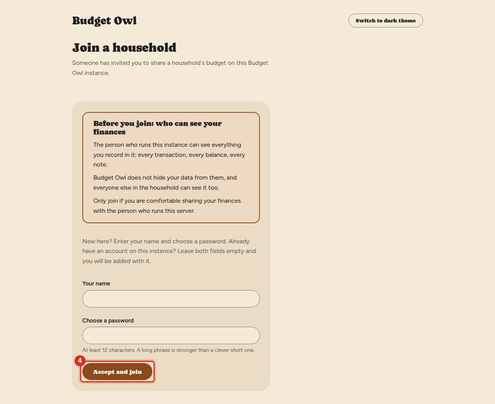
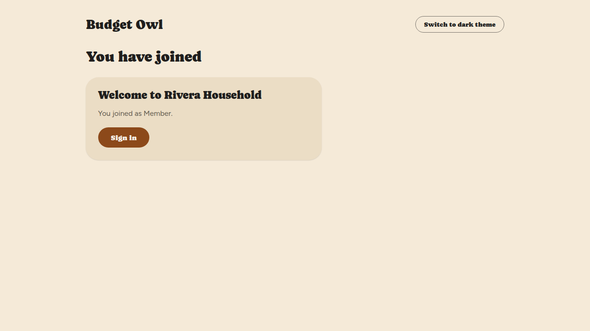
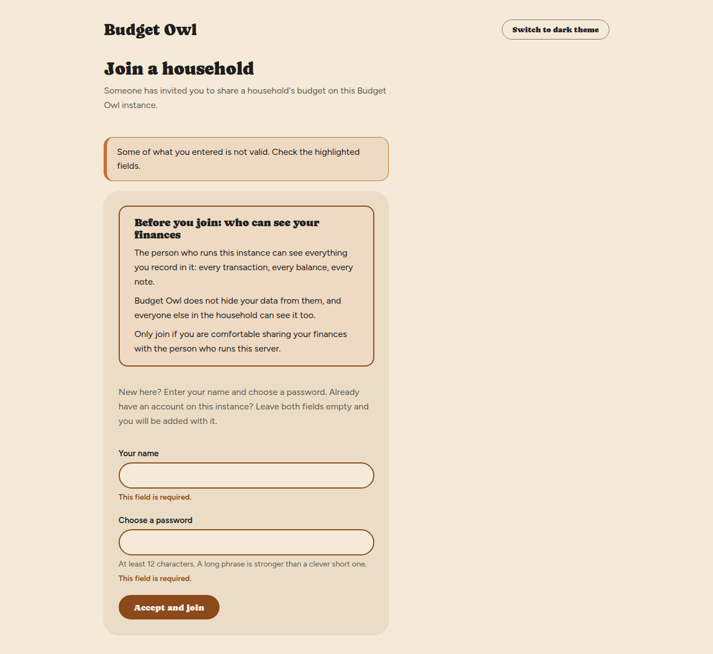
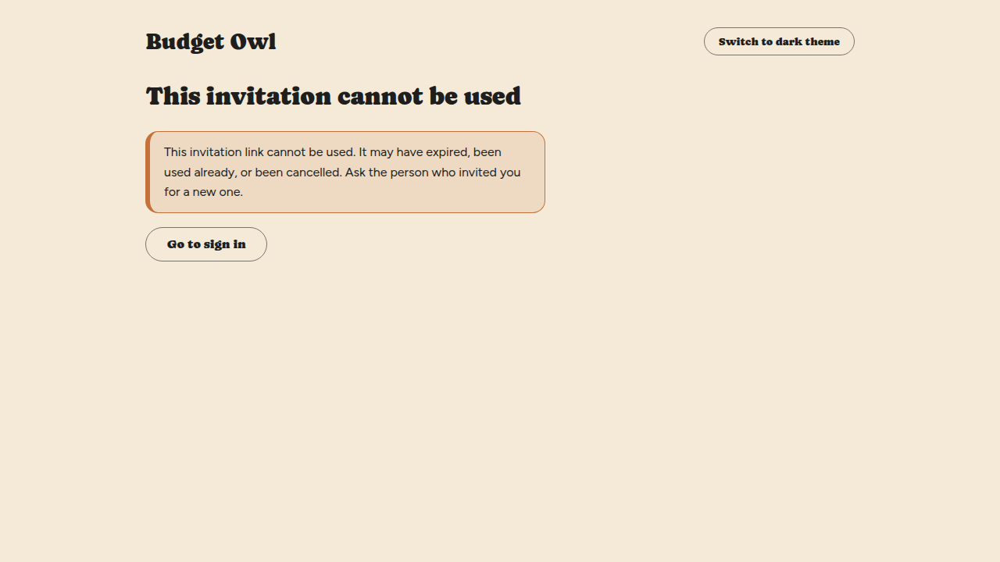
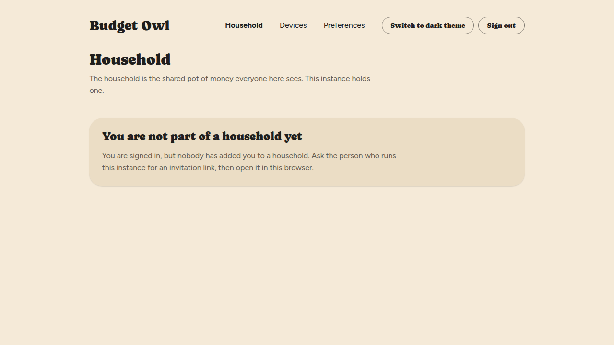

# Join a household

Someone has sent you an invitation link to share their household's budget. This is how you
accept it — whether you are new to this Budget Owl server or already have an account on it.

## Before you start

- You need the invitation link from the person who invited you. Treat it like a password until
  you have used it: anyone who has it could join in your place.
- If you are already signed in to Budget Owl in this browser, the link will ask you to sign out
  first. Select **Sign out** on that screen, and the invitation appears.

**Read this before you accept: the person who runs this server can see everything you record.**
Every transaction, every balance, every note. Budget Owl does not hide your data from them, and
everyone else in the household can see it too. Join only if you are comfortable sharing your
finances with the person who runs this server. If you do not know who that is, ask the person who
invited you before you accept.

The invitation screen says this to you in the same plain words, above the button you press to
join.

## If you are new to this server

1. Open the invitation link in your web browser.

   You'll see a screen called **Join a household**, with a notice titled **Before you join: who
   can see your finances**.

2. Read the notice.

   

3. Enter your name in **Your name**.

4. Enter a password in **Choose a password**.

   It needs at least 12 characters. A long phrase is stronger than a clever short password.

5. Select **Accept and join**.

   You'll see **You have joined**, then **Welcome to** and the household's name. It says which
   role you joined with, and **Your account has been created.**

   

6. Select **Sign in**.

   You'll see the **Sign in** screen with the message **You have joined the household. Sign in to
   continue.**

   

7. Sign in with your email address and the password you just chose.

   Use the email address your invitation was made for. If you are not sure which one that is, ask
   the person who invited you which address they typed. Joining does not sign you in by itself —
   this step does. See [Sign in](sign-in.md).

## If you already have an account on this server

1. Open the invitation link in your web browser.

   You'll see the same **Join a household** screen.

2. Read the notice **Before you join: who can see your finances**.

3. Leave **Your name** and **Choose a password** empty.

   The screen tells you to do this if you already have an account on this instance. Budget Owl adds
   the account that belongs to the email address the invitation was made for.

4. Select **Accept and join**.

   

   You'll see **Welcome to** and the household's name, and the role you joined with. It does not
   say your account has been created, because it was not.

   

5. Select **Sign in** and sign in with your usual email address and password.

   Your new household is the one you see.

## What you'll see

After you sign in, you land on the **Household** screen. You are in the **Members** list with the
role you were invited as. What that lets you do is described in
[What the three roles mean](manage-members.md#what-the-three-roles-mean).

## Things that can go wrong

**"Some of what you entered is not valid. Check the highlighted fields." and "This field is
required."**
You left **Your name** or **Choose a password** empty, but the invitation was for someone who is
new to this server. Fill in both boxes. The notice about who can see your finances stays on
screen.

**"This invitation link cannot be used."**
The link has expired, has been used already, or has been cancelled. Budget Owl gives the same
answer for all three. Ask the person who invited you for a new one.

**You are signed in, but you see "You are not part of a household yet."**
Nobody has added you to a household. That screen suggests asking for an invitation link and
opening it in the same browser; because you are signed in, the link will first ask you to sign
out. Do that, then accept.

## Related

- [Sign in](sign-in.md)
- [Your display currency and language](your-display-settings.md)
- [What the roles mean, and managing members](manage-members.md)
