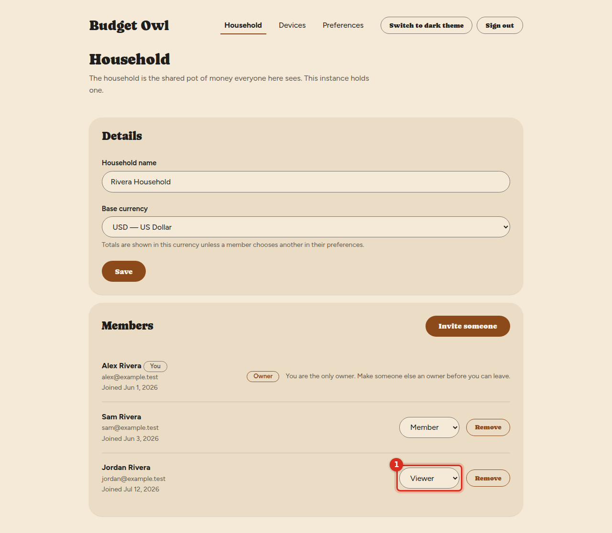
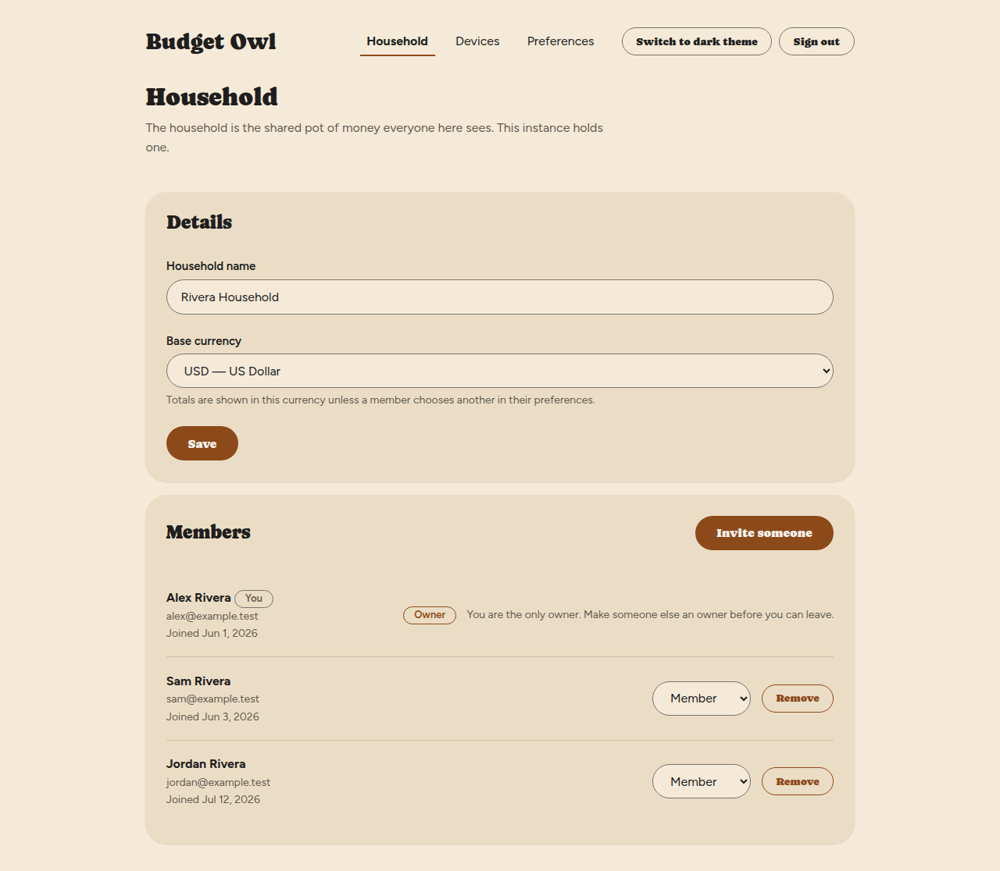
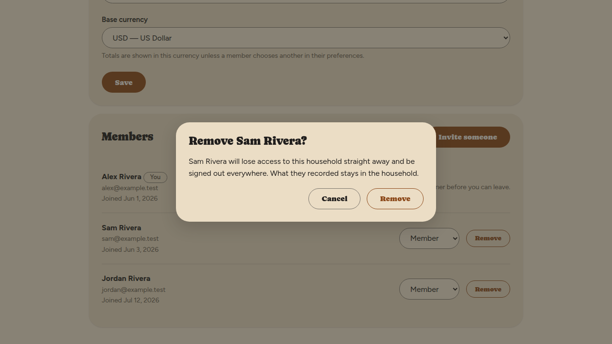
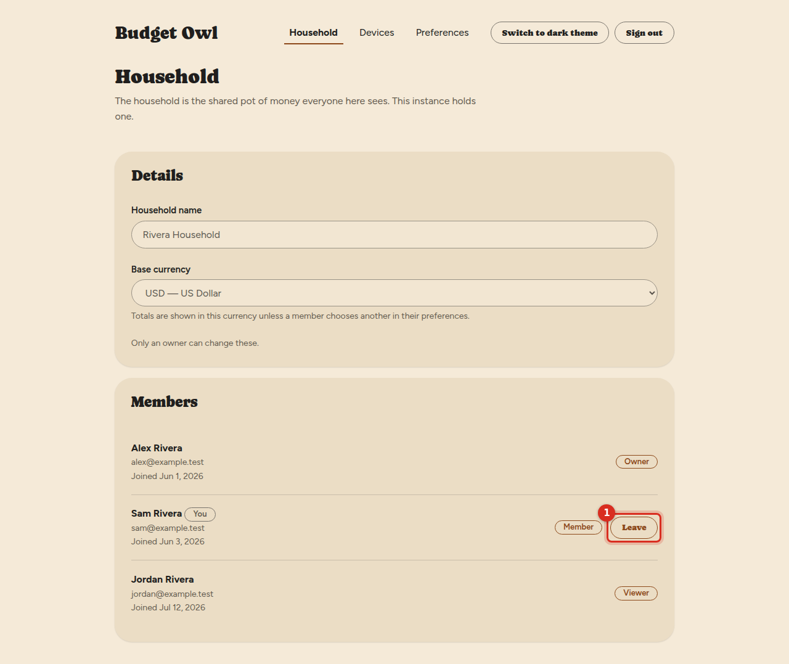
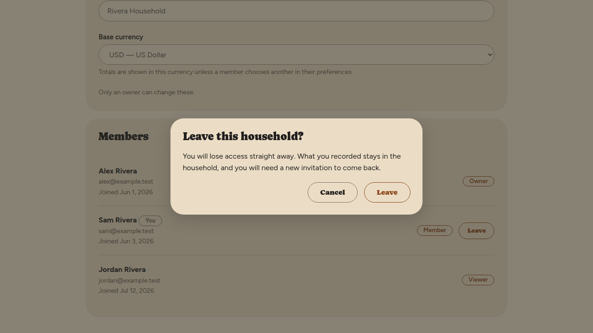
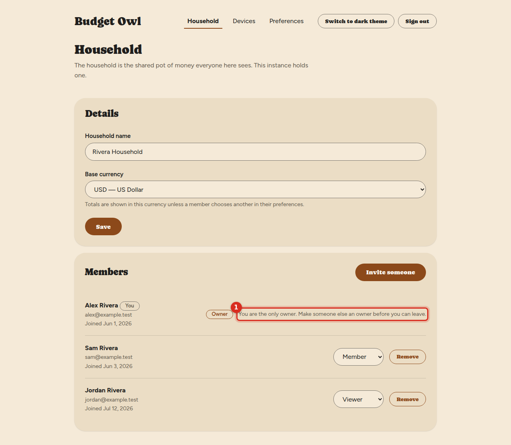

# See who is in your household, and change what they can do

The **Household** screen shows everyone who shares your household and what each person is
allowed to do. From it, an owner can change someone's role or remove them, and anyone can leave.

## What the three roles mean

Every person in a household has one role.

| Role | What they can do |
|---|---|
| **Owner** | Everything, including inviting people, removing people, changing roles, and changing the household's name and base currency. |
| **Member** | See and change the household's money. They can see who is in the household, but cannot invite, remove, or change roles or settings. |
| **Viewer** | See the household's money, but not change it. |

A household always has at least one owner. You can have more than one.

**A role limits what someone can do inside Budget Owl. It does not limit who can see your data.**
The person who runs the server Budget Owl is installed on can see everything your household
records — every transaction, every balance, every note — whatever role they have in it, or even
if they are not in it at all. Every person you invite is told this before they join.

## See who is in your household

1. Select **Household** in the menu across the top.

   You'll see the **Household** screen. Under **Members**, each person is listed with their name,
   email address, the date they joined, and their role. You are marked **You**.

   

If you are not an owner, the **Household name** and **Base currency** are greyed out, with
the note **Only an owner can change these.** You also will not see **Invite someone**, **Remove**,
or a role list beside other people's names.

## Change someone's role

You need to be an owner.

1. Go to **Household**.

2. Find the person under **Members**.

   Their current role is shown in a list beside their name.

3. Select that list and choose **Owner**, **Member** or **Viewer**.

   

   The list changes to the role you chose. No other message appears, so check the list to be sure
   it did.

   

You cannot change your own role. There is no list beside your name.

## Remove someone

You need to be an owner.

1. Go to **Household**.

2. Select **Remove** beside the person's name.

   A window asks, for example, **Remove Sam Rivera?** It explains that they will lose access to
   the household straight away and be signed out everywhere, and that what they recorded stays in
   the household.

   

3. Select **Remove**.

   They disappear from the **Members** list. To change your mind, select **Cancel** instead —
   nothing happens.

If you remove someone by mistake, invite them again — see [Invite someone](invite-someone.md).
They will need a new link.

## Leave a household

You are asked to confirm, and you lose access straight away.

1. Go to **Household**.

2. Select **Leave** beside your own name.

   

   A window asks **Leave this household?** It says you will lose access straight away, that what
   you recorded stays in the household, and that you will need a new invitation to come back.

   

3. Select **Leave**.

   You are no longer in the household. If you go to **Household** afterwards, you'll see **You
   are not part of a household yet.**

### If there is no Leave button

If you are the only owner, there is no **Leave** button. Beside your name it says **You are the
only owner. Make someone else an owner before you can leave.**

To leave, first change another person's role to **Owner** (see above). Then **Leave** appears.

## Things that can go wrong

**I do not see Invite someone or Remove.**
Only owners see them. Ask an owner of your household to do it, or to make you an owner.

## Related

- [Invite someone to your household](invite-someone.md)
- [Join a household](join-a-household.md)
- [Your display currency and language](your-display-settings.md)
