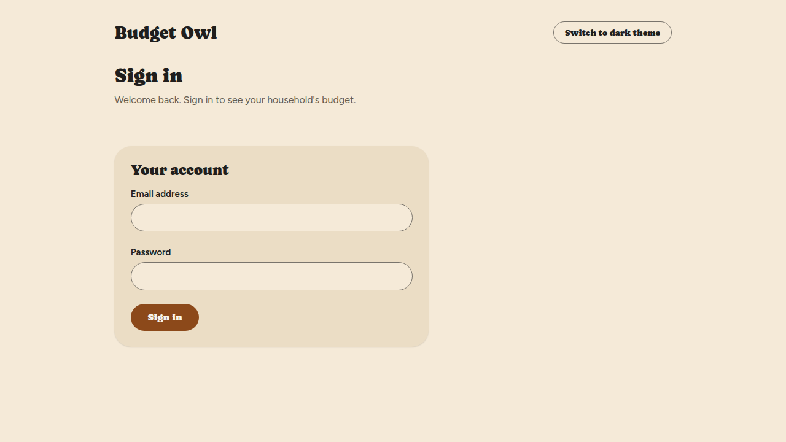
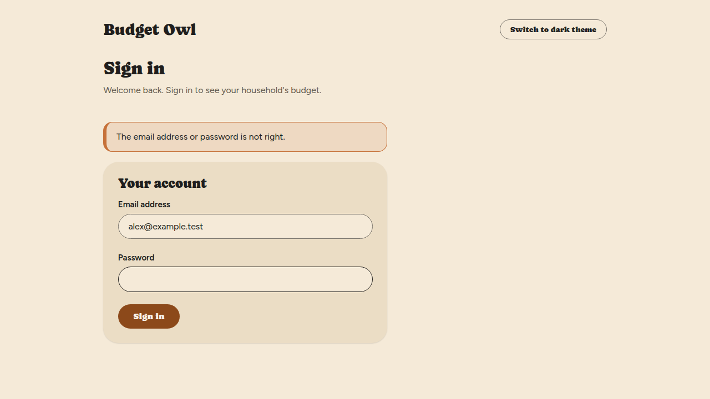
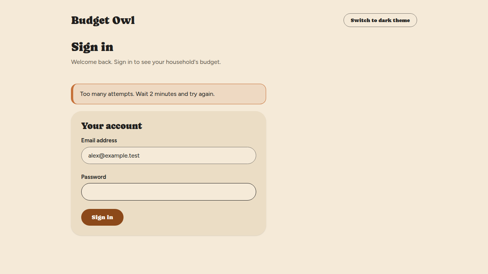
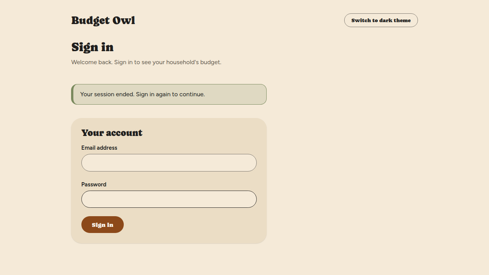

# Sign in

Sign in to see your household's budget. You need an account first — either the one you created
when you set Budget Owl up, or one you made by accepting an invitation.

## Before you start

You need the address of your Budget Owl server, the email address on your account, and your
password. If you do not have an account yet, see
[Create your account and household](create-your-account.md) or
[Join a household](join-a-household.md).

## Steps

1. Open Budget Owl in your web browser, at the address of your server.

   You'll see the **Sign in** screen.

   

2. Enter your email address in **Email address**.

3. Enter your password in **Password**.

4. Select **Sign in**.

   You land on the **Household** screen, and a menu appears across the top with **Household**,
   **Devices** and **Preferences**.

To sign out, select **Sign out** at the top right of any screen.

## Things that can go wrong

**"The email address or password is not right."**
Either the address or the password does not match an account. Budget Owl does not say which, on
purpose. Check for a typo in both. The password box is emptied after a failed try, so type it
again.

**"Too many attempts. Wait 2 minutes and try again."**
Budget Owl slows down repeated sign-in attempts. Wait for the time the message gives, then try
again. The number of minutes in your message may differ from the one here.

**"Your session ended. Sign in again to continue."**
You were signed out — because you were away for a while, or because someone signed this browser
out from the **Devices** screen. Sign in again. Nothing you saved is lost.

**You have forgotten your password.**
The Sign in screen has no "Forgot password" option, so you cannot reset it from there. Ask the
person who runs your server for help.

**The server cannot be reached.**
You'll see a message saying so. Check that you are on the right address and that the server is
running.

## Related

- [Your signed-in devices](your-devices.md)
- [Install Budget Owl](../installing.md)
