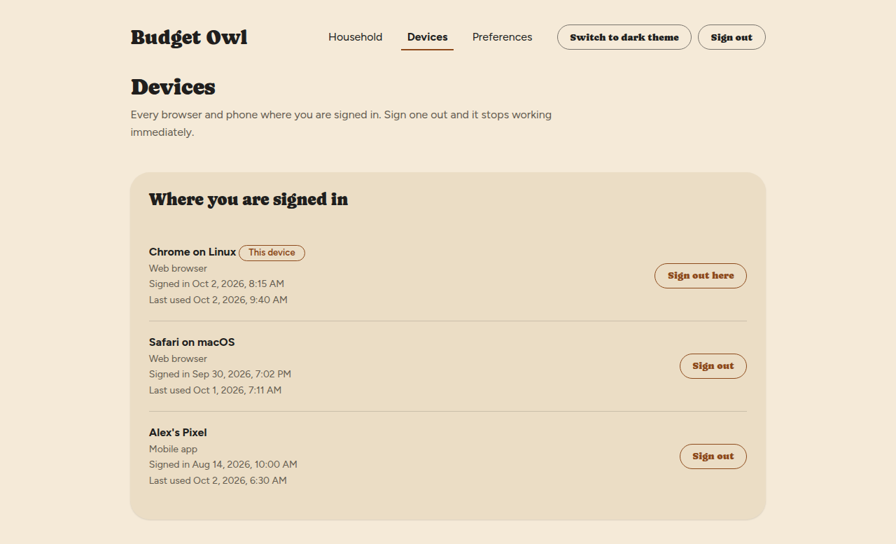
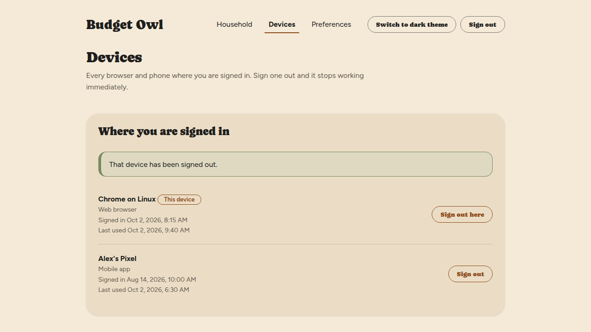
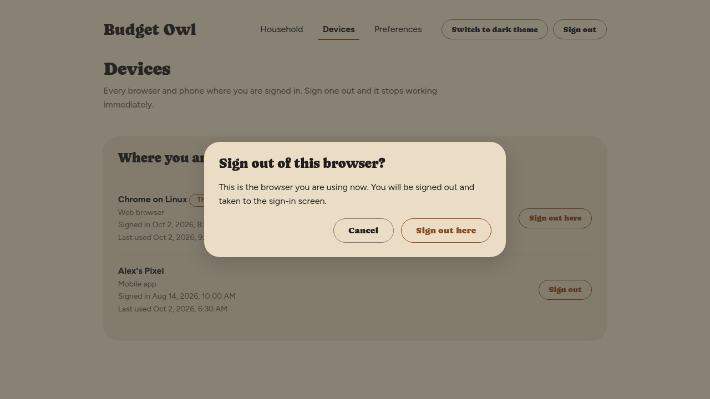

# See where you are signed in, and sign a device out

Budget Owl lists every browser and phone where you are signed in. If you lose a phone, or used
someone else's computer, you can sign it out from here, and it stops working straight away.

## Steps

1. Select **Devices** in the menu across the top.

   You'll see a list called **Where you are signed in**. Each row shows what the device is — for
   example **Chrome on Linux** or **Safari on macOS** — whether it is a **Web browser** or a
   **Mobile app**, when you signed in on it, and when it was last used. The one you are using now is
   marked **This device**.

   

2. Find the device you do not recognise, or no longer have.

3. Select **Sign out** on its row.

   You'll see **That device has been signed out.** and the row disappears from the list. That
   device stops working straight away, and whoever is using it has to sign in again.

   

## Sign out of the browser you are using

1. Select **Sign out here** on the row marked **This device**.

   A window asks **Sign out of this browser?** It says you will be signed out and taken to the
   sign-in screen.

   

2. Select **Sign out here** in the window.

   You'll see the **Sign in** screen. You can also select **Sign out** at the top right of any
   screen.

## Things that can go wrong

**I see a device I do not recognise.**
Sign it out first. Then be aware that there is no screen for changing your password in Budget Owl
yet, so if you think someone else knows your password, tell the person who runs your server.

## Related

- [Sign in](sign-in.md)
