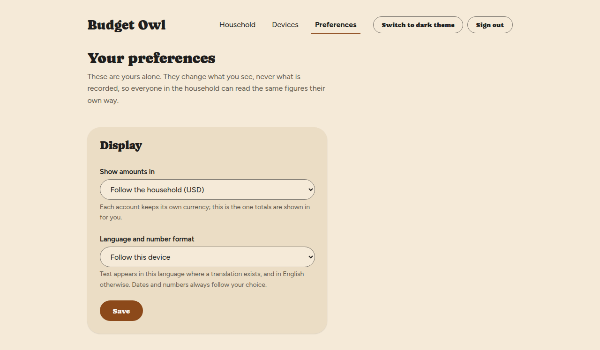
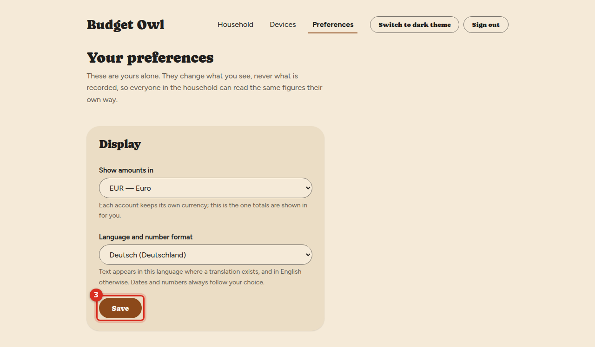
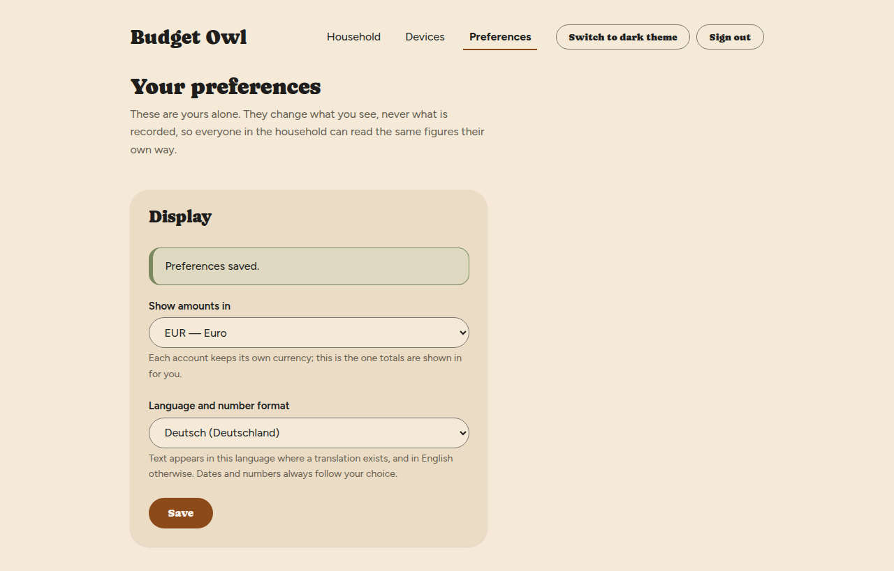

# Choose the currency and language you see

Pick the currency your totals appear in, and the language and number format you read them in.
These are yours alone: they change what you see, never what is recorded, so everyone in the
household can read the same figures their own way.

## Steps

1. Select **Preferences** in the menu across the top.

   You'll see the **Your preferences** screen with two lists.

   

2. Choose a currency in **Show amounts in**.

   To begin with it says **Follow the household**, with the household's currency in brackets, for
   example **(USD)**. Each account keeps its own currency; this is the currency totals are shown
   in for you.

3. Choose a language in **Language and number format**.

   To begin with it says **Follow this device**, which uses your browser's settings.

4. Select **Save**.

   

   You'll see **Preferences saved.**

   

## What you'll see

After you save, dates and numbers follow your choice. For example, choosing German
(Germany) changes a date such as Jun 1, 2026 to 01.06.2026.

Words on the screen change to your language **where a translation exists, and to English
otherwise**. Budget Owl is not translated into every language in the list yet, so choosing one
may change dates and numbers but leave the words in English. For a language written right to
left, the whole layout flips.

## Go back to the default

Choose **Follow the household** and **Follow this device** again, then select **Save**.

## Things that can go wrong

**I chose a language and the words are still in English.**
That language has no translation yet. Dates and numbers still follow your choice.

**Someone else's screen looks different from mine.**
That is expected. Each person chooses their own, and it does not change anyone else's.

## Related

- [Create your account and household](create-your-account.md) — where the household's own currency is chosen
