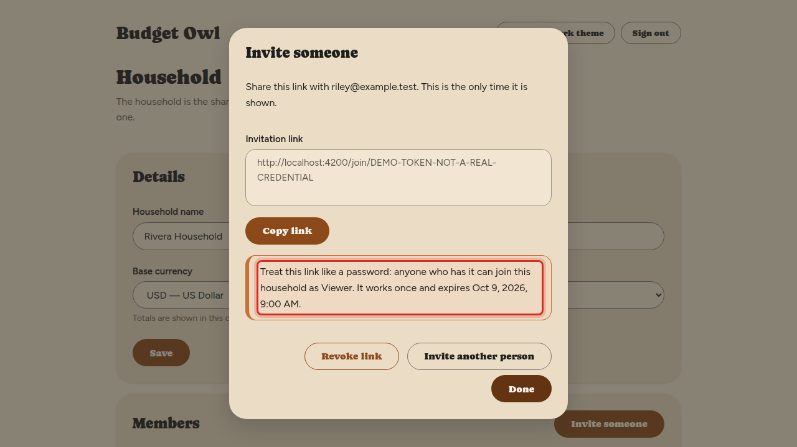

# Getting started

> **Status: partly written.** Steps 1 and 1b below are written from the running app. Steps 2
> onward are still outlines: their screens do not exist yet, and each gets written, with real
> screenshots, as its slice ships. See `docs/roadmap.md` for the order.
>
> **Do not write steps here from the feature docs.** Feature docs describe what we intend to
> build; a user guide describes what shipped. Write each section only after running
> `tools/userguide-capture.sh` and looking at what is actually on screen.

Budget Owl helps you see where your money goes and plan where it should go. This walks you
through your first fifteen minutes, from creating your household to reading your first month's
budget.

**Already installed?** Good — start at step 1. If not, see
[Installing Budget Owl](installing.md) first.

## 1. Create your account and household

The first time Budget Owl starts, it asks you to create one account. That account becomes the
**owner** of a new household — the shared space everything else lives in.

1. Open Budget Owl in your web browser, at the address of your server.

   You'll see **Set up Budget Owl**.

2. Fill in **Your name**, **Email address**, **Password** and **Household name**.

   The password needs at least 12 characters. **Base currency** starts as **USD — US Dollar**;
   change it if your household uses another.

3. Select **Create account**.

   You are signed in, and you land on the **Household** screen with yourself listed as **Owner**.

**You will be able to see everything anyone in your household records.** You are the person
running this instance, so every transaction, every balance and every note in it is visible to you.
Budget Owl does not hide it, and anyone you invite is told this before they join.

Full steps, and what to do when something goes wrong:
[Create your account and household](features/create-your-account.md). Next time, you
[sign in](features/sign-in.md) instead. If your server is set up to use your own login provider,
that option is not covered here yet — email and password is.

## 1b. Invite the rest of your household

Budget Owl does not send email. You create an invitation link and send it to the person yourself.

1. Go to **Household** and select **Invite someone**.

2. Enter their email address, choose their role, and select **Create link**.

   You'll see the link, and a warning: **Treat this link like a password.**

3. Select **Copy link**, and send it to them.

   

**The link works like a password.** Anyone who has it can join your household, so send it only to the
person you mean, and revoke it if it reaches anyone else. It works once and expires on the date shown
under it.

**The roles:**

- **Owner** — everything, including inviting and removing people.
- **Member** — can see and change the household's money.
- **Viewer** — can see the household's money, but not change it.

The person who runs the server can see everything your household records, whatever anyone's role.
The person you invite is told this before they join.

Full steps: [Invite someone to your household](features/invite-someone.md). What the person you
invite goes through: [Join a household](features/join-a-household.md). Changing roles, removing
people, and leaving: [See who is in your household](features/manage-members.md).

## 2. Add your accounts

*Awaiting slice 3.*

Will cover: adding a checking account, a savings account, and a credit card; what an opening
balance is and where to find yours; why a credit card balance shows as negative.

## 3. Set up your categories

*Awaiting slice 4.*

Will cover: the categories you start with, renaming them to match how you actually think about
your money, and adding your own.

## 4. Record your first transactions

*Awaiting slice 5.*

Will cover: adding an expense, adding income, categorising as you go, and how your account
balance updates.

## 5. Give your spending an envelope

*Awaiting slice 6.*

Will cover: setting an amount for groceries, logging what you spend against it as you go, and
reading the one number that matters — what is left. Works whether or not you ever connect a bank.

## 6. Put in your bills and income

*Awaiting slice 7.*

Will cover: rent, subscriptions and payday — entering something once so it appears every month,
and letting Budget Owl match a bill to the real charge that pays it.

## 7. Move money between your own accounts

*Awaiting slice 8.*

Will cover: recording a transfer, and why a transfer is neither income nor an expense — the
thing people most often get wrong and then wonder why their totals look off.

## 8. Make a plan for what you owe

*Awaiting slice 10.*

Will cover: entering a debt's terms, choosing between paying the highest rate first or the
smallest balance first, and seeing what each one does to the date you are finally clear.

## 9. See where your money went

*Awaiting slice 13.*

Will cover: reading the reports, spotting the category that surprised you, and comparing months.

## 10. Put it on your phone

*Awaiting slice 15.*

Will cover: installing the mobile app, pointing it at your own server, and adding a transaction
while you are standing in the shop — which is where most budgeting actually happens.

## Where to go next

Once these exist, each section links to the full guide for that feature in
[the help index](README.md).
